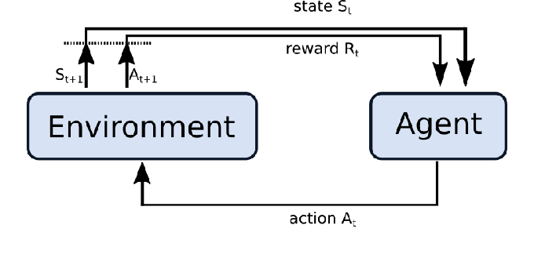

# Blog: Understanding Decision Transformer Paper

*Authored by Wang Xu at 22 Oct, 2024.*  

*Estimated Reading Time: 15~20 minutes*

What if we could revolutionize reinforcement learning by treating it like language modeling? The Decision Transformer paper explores exactly that, and in this blog, I’ll break it down.

*Chen, L., Lu, K., Srinivas, A., Abbeel, P., & Malik, J. (2021). Decision Transformer: Reinforcement Learning via Sequence Modeling. [arXiv preprint arXiv:2106.01345](https://arxiv.org/abs/2106.01345)*

### **Content Outline:**

1. Introduction
2. Preliminaries
3. Method
4. Evaluation on Offline RL Benchmarks
5. Discussion
6. Conclusion
7. Applications and Future Directions

## **1. Introduction**

Reinforcement learning (RL) has always been a bit of a balancing act between **learning good behavior** and **not messing up too much** while exploring. Most traditional methods like **Q-learning** or **policy gradient** struggle with this balance, especially in environments where exploration is costly or limited. They rely heavily on **value functions**, constantly trying to estimate the best action to take at each step. It’s like trying to predict the weather 100 times a day—tiring and not always accurate!



[*Fig. 1. The agent-environment cycle visualizes the main principles of reinforcement learning: observing states, choosing actions, and receiving rewards.*](https://www.ias.informatik.tu-darmstadt.de/uploads/Teaching/HumanoidRoboticsSeminar/HR_Report_21_22_Timo_Imhof_Decision_Transformer.pdf)

But, what if we approached RL like a **sequence modeling problem**, much like how we process language? That’s where **Decision Transformers (DT)** come in. This paper brings a fresh perspective: what if RL agents could learn from past decisions in a sequence, like how we predict the next word in a sentence? Instead of continuously optimizing value functions, DT uses **transformer models** to predict the next best action based on the past, making it super scalable and efficient.


[*Fig. 2. Encoder-Decoder structure of a Transformer. An input sequence is passed through a series of encoders sequentially, after which the final encoder output is passed in parallel to a stack of decoders.*](https://www.ias.informatik.tu-darmstadt.de/uploads/Teaching/HumanoidRoboticsSeminar/HR_Report_21_22_Timo_Imhof_Decision_Transformer.pdf) 

## **2. Preliminaries**

### Offline RL and Trajectory Rollouts

First, let’s talk about **Offline RL**. Here, the agent isn’t running around in real-time collecting data like a hyperactive squirrel. Instead, it’s given a **fixed dataset** with recorded experiences (or **trajectory rollouts**). These are just sequences of states, actions, and rewards that the agent learns from—kind of like watching game replays before you try it out yourself.

### The Transformer Architecture in RL

If you’ve ever worked with natural language processing, you’ve probably heard of **Transformers**. This architecture excels at capturing relationships in sequences. In RL, where decisions depend on previous states and actions, transformers fit in perfectly. They use key features like **self-attention** (which helps the model focus on the most important past actions) and **multi-head attention** (which allows it to look at different parts of the past simultaneously). This is why Transformers can handle RL's decision-making process so well.


[*Fig. 3. Single self-attention operation. The keys, queries and values concept outputs a weighted version of the input with more context added.*](https://www.ias.informatik.tu-darmstadt.de/uploads/Teaching/HumanoidRoboticsSeminar/HR_Report_21_22_Timo_Imhof_Decision_Transformer.pdf)

### Sequence Modeling in RL

Now, here’s the real twist: DT treats RL problems like sequence modeling. Think of it like predicting the next word in a sentence—only here, it’s predicting the next action in a trajectory (like moving left, right, or jumping over an obstacle). The model uses **state-action-reward** sequences, similar to how a language model uses **word-context-meaning**. This approach allows the model to **predict future actions based on past decisions**, which turns out to be surprisingly effective!


[*Fig.4.Decision Transformer architecture. States, actions, and returns are fed into modalityspecific linear embeddings and a positional episodic timestep encoding is added. Tokens are fed into a GPT architecture which predicts actions autoregressively using a causal self-attention mask.*](https://arxiv.org/pdf/2106.01345)


[*Fig. 5. GPT architecture used for the Decision Transformer. After an input sequence is passed through the input embeddings and positional encodings it is processed by N stacked identical decoders.*](https://www.ias.informatik.tu-darmstadt.de/uploads/Teaching/HumanoidRoboticsSeminar/HR_Report_21_22_Timo_Imhof_Decision_Transformer.pdf) 

## **3. Method**

### What is Return-to-Go?

You’ve heard of **reward signals** in RL, right? DT adds a cool new concept called **Return-to-Go (RTG)**. Basically, instead of using a cumulative reward like traditional methods, RTG is a measure of the **expected remaining reward**. Think of it as the agent’s GPS guiding it toward better future outcomes—telling it, "Hey, if you keep making good decisions, you should hit this reward!" RTG conditions the model on what it wants to achieve.

- The RTG  $\hat{R}_t$ is the sum of rewards starting from time  t  up to the final time  T , represented as: 
$\hat{R}_t = \sum_{t' = t}^{T} r{t'}$ , where  $r_{t'}$  is the reward at each time step.
- This leads to the following trajectory representation which is amenable to autoregressive training and generation:
    
     $\tau = \left( \hat{R}_1, s_1, a_1, \hat{R}_2, s_2, a_2, \dots, \hat{R}_T, s_T, a_T \right)$
    

### Using Return-to-Go for Trajectory Representation

In Decision Transformers, the past actions, states, and RTG are fed into the model. The transformer uses this info to predict the next action—like piecing together a puzzle where each past action helps predict the next best move. The beauty here is that the **transformer can “look back” at what happened and “plan forward”** to maximize future rewards. Pretty neat, right?


[*Fig. 6. Illustrative example of finding shortest path for a fixed graph (left) posed as reinforcement
learning. Training dataset consists of random walk trajectories and their per-node returns-to-go
(middle). Conditioned on a starting state and generating largest possible return at each node, Decision Transformer sequences optimal paths.*](https://arxiv.org/pdf/2106.01345)

[Algorithm: Decision Transformer Pseudocode (for continuous actions)](https://arxiv.org/pdf/2106.01345)

```python
# R, s, a, t: returns -to -go , states , actions , or timesteps
# transformer : transformer with causal masking (GPT)
# embed_s , embed_a , embed_R : linear embedding layers
# embed_t : learned episode positional embedding
# pred_a : linear action prediction layer
# main model
def DecisionTransformer (R , s , a , t ):
	# compute embeddings for tokens
	pos_embedding = embed_t ( t ) # per - timestep ( note : not per - token )
	s_embedding = embed_s ( s ) + pos_embedding
	a_embedding = embed_a ( a ) + pos_embedding
	R_embedding = embed_R ( R ) + pos_embedding
	
	# interleave tokens as (R_1 , s_1 , a_1 , ... , R_K , s_K )
	input_embeds = stack ( R_embedding , s_embedding , a_embedding )
	# use transformer to get hidden states
	hidden_states = transformer ( input_embeds = input_embeds )
	# select hidden states for action prediction tokens
	a_hidden = unstack ( hidden_states ). actions
	# predict action
	return pred_a ( a_hidden )
	
# training loop
for (R , s , a , t ) in dataloader : # dims : ( batch_size , K, dim )
	a_preds = DecisionTransformer (R , s , a , t )
	loss = mean (( a_preds - a )**2) # L2 loss for continuous actions
	optimizer.zero_grad (); loss.backward (); optimizer.step ()

# evaluation loop
target_return = 1 # for instance , expert - level return
R , s , a , t , done = [ target_return ] , [ env . reset ()] , [] , [1] , False
while not done : # autoregressive generation / sampling
	# sample next action
	action = DecisionTransformer (R , s , a , t )[ -1] # for cts actions
	new_s , r , done , _ = env.step ( action )

	# append new tokens to sequence
	R = R + [ R [ -1] - r] # decrement returns -to -go with reward
	s , a , t = s + [ new_s ] , a + [ action ] , t + [ len ( R )]
	R , s , a , t = R [ - K :] , ... # only keep context length of K
```

## **4. Evaluation on Offline RL Benchmarks**

Now, let’s see how DT stacks up against two popular methods:

- **TD-learning (CQL)**: This traditional method estimates value functions step-by-step. While it’s effective, it can struggle in certain environments, especially when the data is noisy or sparse.
- **Imitation learning (Behavior Cloning)**: This one mimics expert behavior directly but can fail when data is scarce or noisy.

**Atari Games (Discrete Environment)**: DT outshines both methods in environments like **Atari games**, where it can identify patterns in the data and predict actions effectively. Even when the data is messy, DT uses its sequence modeling magic to figure out the best moves.

**OpenAI Gym Control Tasks (Continuous Environment)**: DT also performs great in **continuous environments**, where actions need to be finely controlled, like in robotics tasks. Even with long-term dependencies and delayed rewards, DT nails it by planning forward better than TD learning or behavior cloning.


[Fig. 7. Results comparing Decision Transformer (ours) to TD learning (CQL) and behavior cloning across Atari, OpenAI Gym, and Minigrid. On a diverse set of tasks, Decision Transformer performs comparably or better than traditional approaches.](https://arxiv.org/pdf/2106.01345)

## **5. Discussion**

### Does DT Perform Behavior Cloning?

Well, DT does **mimic expert behavior** in some cases, but it doesn’t stop there. When there’s **plenty of data**, DT matches or even outperforms behavior cloning. However, in **low-data settings**, behavior cloning weakens while DT manages to thrive, learning from smaller amounts of data by recognizing key patterns in the sequences.


[*Tab. 1. Comparison between Decision Transformer (DT) and Percentile Behavior Cloning (%BC).*](https://arxiv.org/pdf/2106.01345)

### What About DT’s Distribution of Returns?

DT models returns so well that it often **perfectly matches the desired returns**, sometimes even **exceeding expectations**! It has a knack for predicting better outcomes based on past sequences.


[*Fig. 8. Sampled (evaluation) returns accumulated by Decision Transformer when conditioned on the specified target (desired) returns. Top: Atari. Bottom: D4RL medium-replay datasets.*](https://arxiv.org/pdf/2106.01345)

### Context Length and Its Benefits

Here’s an interesting bit: DT’s **context length (K)** represents how much past info it looks at. The **larger K is**, the more past information DT uses to make decisions, helping it identify the policy that generated the actions. Bigger K? Better learning.


[*Tab. 2. Ablation on context length. Decision Transformer (DT) performs better when using a longer context length (K = 50 for Pong, K = 30 for others).*](https://arxiv.org/pdf/2106.01345)

### Long-term Credit Assignment

Here’s a fun example: In the **Key-to-Door** environment (where you have to grab a key, then open a door, but rewards are delayed), DT excels. Traditional TD-learning struggles because it has trouble assigning credit to the earlier key-grabbing action. DT, however, connects the dots beautifully, **tracking important events across the whole episode**.

Even in environments where rewards are only given at the end of a sequence (delayed return settings), DT remains robust, unlike TD-learning which falls apart.


[*Tab. 3.  Success rate for Key-to-Door environment. Methods using hindsight (Decision Transformer, %BC) can learn successful policies, while TD learning struggles to perform credit assignment.*](https://arxiv.org/pdf/2106.01345)

## **6. Conclusion**

In summary, **Decision Transformers** prove that we can apply sequence modeling—something transformers excel at—to **reinforcement learning**. With minimal tweaks to traditional transformer architectures, DT matches or even outperforms more specialized RL algorithms like CQL. Not only that, DT can handle **long-term dependencies** and **delayed rewards** with ease.

DT doesn’t need explicit optimization with value functions like other RL methods, making it a flexible and powerful tool for various decision-making tasks.

## **7. Applications and Future Directions**

### Applications

Beyond Atari and robotics, **Decision Transformers** have big potential in domains like:

- **Finance**: Predicting market trends based on historical trading data.
- **Healthcare**: Recommending treatments by analyzing patient history.
- **Autonomous Systems**: Helping self-driving cars or drones make smart, long-term decisions.

### Limitations and Challenges

Of course, DT isn’t perfect. It requires a lot of **computational power** and depends on **large offline datasets**. As we continue to improve DT, future research might focus on **reducing data needs** and exploring ways to combine DT with **online RL**.

---

And there you have it! Decision Transformers are a fresh, powerful approach to reinforcement learning by treating it like a sequence modeling problem. It's efficient, smart, and adaptable, making it a strong competitor to traditional RL methods. Stay tuned for more exciting developments in this field!

## Reference:

- *Chen, L., Lu, K., Srinivas, A., Abbeel, P., & Malik, J. (2021). Decision Transformer: Reinforcement Learning via Sequence Modeling. [arXiv preprint arXiv:2106.01345](https://arxiv.org/abs/2106.01345)*
- *Imhof, Timo. “A Review of the Decision Transformer Architecture: Framing Reinforcement Learning as a Sequence Modeling Problem.” (2022).[https://www.ias.informatik.tu-darmstadt.de/uploads/Teaching/HumanoidRoboticsSeminar/HR_Report_21_22_Timo_Imhof_Decision_Transformer.pdf](https://www.ias.informatik.tu-darmstadt.de/uploads/Teaching/HumanoidRoboticsSeminar/HR_Report_21_22_Timo_Imhof_Decision_Transformer.pdf)*
